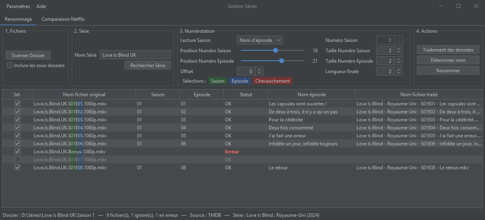
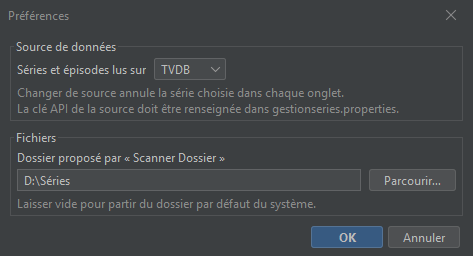
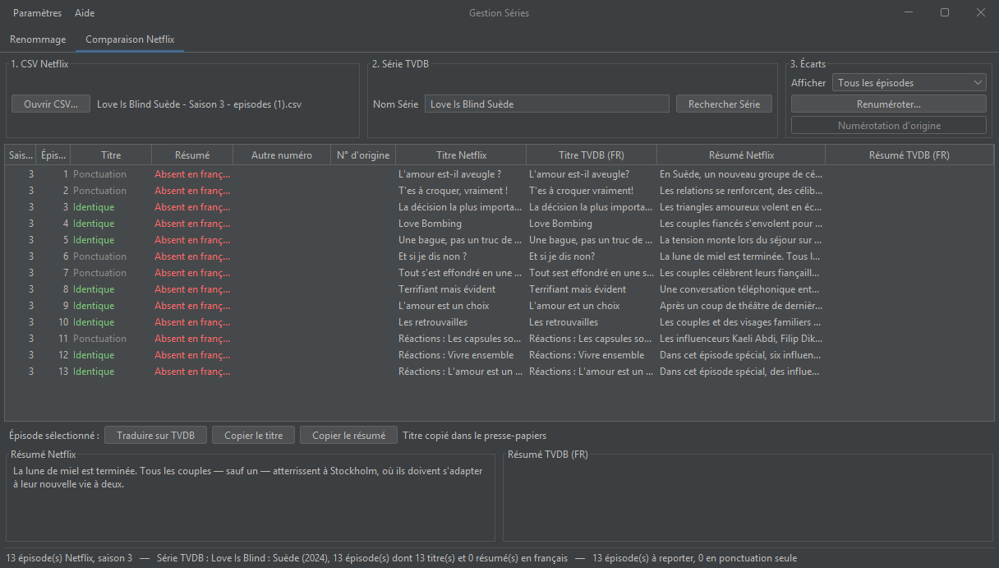

# GestionSeries

Application de bureau Java (Swing) pour **renommer automatiquement des fichiers d'épisodes de séries TV** à partir des informations de [TheTVDB](https://thetvdb.com) ou de [TMDB](https://www.themoviedb.org), au choix.

À partir de noms de fichiers comme `show.s02e05.720p.mkv`, GestionSeries retrouve le titre de chaque épisode (en français quand il existe) et renomme les fichiers sous une forme homogène :

```
Nom de la série - S02E05 - Titre de l'épisode.mkv
```



Un second onglet **compare les épisodes d'une saison Netflix avec la source de données** pour repérer les traductions françaises manquantes ou différentes, et préparer leur saisie sur le site de la source.

## Fonctionnalités

### Source de données

- **Deux sources au choix** : [TheTVDB](https://thetvdb.com) (API v4) ou [TMDB](https://www.themoviedb.org) (API v3), dans *Paramètres > Préférences*. Le choix est mémorisé d'un lancement à l'autre et s'applique aux deux onglets.
- Toutes les fonctionnalités sont disponibles avec les deux sources.



### Renommage

- **Recherche de la série dans la source** : liste des résultats avec date de première diffusion et résumé (ainsi que réseau et statut avec TheTVDB), pour distinguer les séries homonymes.
- **Titres d'épisodes en français**, avec repli sur la langue d'origine quand la traduction n'existe pas.
- **Lecture des numéros de saison et d'épisode dans les noms de fichiers**, par position : les caractères sélectionnés sont colorés dans le tableau pour vérifier le réglage d'un coup d'œil.
- **Numéro de saison** lu dans le nom du fichier, dans le nom du dossier, ou saisi manuellement.
- **Parcours récursif des sous-dossiers** (par exemple un dossier par saison).
- **Décalage de numérotation** (offset) et **longueur du numéro d'épisode** paramétrables.
- **Contrôle avant renommage** : sélection des fichiers à traiter, fichiers en erreur signalés avec leur cause, aperçu du nouveau nom.

### Comparaison Netflix ↔ source de données

- **Lecture d'un CSV d'épisodes Netflix**, exporté par l'extension Chrome *NetflixEpisodesExport* (projet séparé) : saison, numéro, titre et résumé en français.
- **Lecture de la saison dans la source**, en distinguant les traductions françaises existantes de celles qui manquent.
- **Mise face à face par numéro d'épisode**, avec un état pour le titre et pour le résumé : épisode absent de la source, absent en français, différent, différent seulement par la ponctuation, identique.
- **Détection des décalages de numérotation** : un titre qui correspond à celui d'un autre numéro est signalé (par exemple quand la source contient des épisodes en plus).
- **Renumérotation** d'une source sur l'autre d'après les titres communs, pour l'affichage seulement.
- **Préparation de la saisie** : ouverture de la page de traduction française de l'épisode (ou d'ajout d'épisodes) sur thetvdb.com ou themoviedb.org, avec le texte à reporter copié dans le presse-papiers. La saisie et la validation restent manuelles.

### Interface

- Interface en **thème sombre** ([FlatLaf](https://www.formdev.com/flatlaf/)).
- Menu *Paramètres > Préférences* pour les réglages de l'application, menu *Aide > À propos* pour les crédits.

## Prérequis

- **Java 21** ou plus récent (JDK pour compiler).
- Une **clé API** pour la source utilisée, à obtenir gratuitement depuis un compte :
  - TheTVDB v4 : [thetvdb.com](https://thetvdb.com/dashboard/account/apikey) ;
  - TMDB : [themoviedb.org](https://www.themoviedb.org/settings/api) (section API des paramètres du compte).

Les bibliothèques nécessaires sont fournies dans le dossier `lib/`.

## Configuration

Les clés API ne sont pas stockées dans le code. Copiez le modèle de configuration :

```
gestionseries.example.properties  →  gestionseries.properties
```

puis renseignez la clé de la source que vous utilisez (seule celle de la source choisie est obligatoire) :

```properties
# Clé API TVDB v4
tvdb.apikey=votre-cle-tvdb

# PIN d'abonné : uniquement pour une clé "user-supported", laisser vide sinon
tvdb.pin=

# Clé API TMDB
tmdb.apikey=votre-cle-tmdb
```

Le fichier `gestionseries.properties` est exclu de Git : **ne versionnez jamais vos clés**.

La source de données se choisit dans l'application (*Paramètres > Préférences*) ; ce choix est mémorisé dans votre profil utilisateur, à part de ce fichier.

Il est recherché, dans l'ordre :

1. au chemin indiqué par l'option `-Dgestionseries.config=...` ;
2. dans le dossier courant (la racine du projet) ;
3. dans votre dossier personnel.

## Lancement

### Avec VS Code

Le projet s'ouvre directement dans VS Code avec l'extension [Extension Pack for Java](https://marketplace.visualstudio.com/items?itemName=vscjava.vscode-java-pack). Dans la vue **Exécuter et déboguer** (`Ctrl+Maj+D`), trois configurations sont disponibles :

- **GestionSeries** : lance l'application ;
- **Test API TVDB** : vérifie la connexion à TheTVDB sans passer par l'interface ;
- **Test API TMDB** : vérifie la connexion à TMDB sans passer par l'interface.

### En ligne de commande (Windows, PowerShell)

Depuis la racine du projet :

```powershell
javac -encoding UTF-8 -d bin -cp "lib/*" (Get-ChildItem -Recurse src -Filter *.java).FullName
Copy-Item src/ui/*.png bin/ui/
java -cp "bin;lib/*" ui.Application
```

Le projet peut aussi être importé dans Eclipse (fichiers `.project` et `.classpath` fournis).

## Utilisation

La fenêtre principale comporte deux onglets indépendants. Ils utilisent la source de données choisie dans *Paramètres > Préférences* ; changer de source annule la série choisie dans chaque onglet.

### Onglet Renommage

L'onglet suit les étapes du traitement :

1. **Fichiers** : cliquez sur *Scanner Dossier* et choisissez le dossier contenant les épisodes. Cochez *Inclure les sous-dossiers* pour parcourir aussi les sous-dossiers. Le dossier proposé à l'ouverture se règle dans *Paramètres > Préférences*.
2. **Série** : saisissez le nom de la série, lancez la recherche (bouton ou touche `Entrée`), puis choisissez la bonne série dans la liste (bouton *Sélectionner* ou double-clic).
3. **Numérotation** : indiquez où lire les numéros de saison et d'épisode dans les noms. Les sélections sont colorées dans la colonne *Nom fichier original* (vert pour la saison, bleu pour l'épisode, rouge en cas de chevauchement). Les positions se comptent à partir de 0.
4. **Actions** :
   - *Traitement des données* : lit les numéros et récupère le titre de chaque épisode ;
   - *Déterminer nom* : calcule le nouveau nom de chaque fichier ;
   - *Renommer* : renomme les fichiers sur le disque.

Seuls les fichiers cochés dans la colonne *Sel.* sont traités. Un fichier dont les numéros ne peuvent pas être lus passe au statut *Erreur* : survolez la ligne pour en voir la raison.

> ⚠️ Le renommage modifie directement les fichiers : vérifiez la colonne *Nom fichier traité* avant de cliquer sur *Renommer*.

Les numéros lus dans les fichiers sont ceux de la source choisie : TheTVDB et TMDB ne numérotent pas toujours les épisodes de la même façon (épisodes spéciaux, épisodes regroupés…). Choisissez la source dont la numérotation correspond à vos fichiers.

### Onglet Comparaison Netflix

1. **CSV Netflix** : cliquez sur *Ouvrir CSV…* et choisissez le fichier exporté (`<Série> - Saison N - episodes.csv`, séparateur `;`, en-tête `Saison;Épisode;Titre;Résumé`).
2. **Série** : le nom de la série est déduit du nom du fichier ; lancez la recherche et choisissez la série. Les saisons présentes dans le CSV sont lues dans la source. Pour une autre saison de la même série, chargez simplement le CSV suivant : la série choisie est conservée.
3. **Écarts** : filtrez le tableau (tous les épisodes, écarts à reporter, écarts ponctuation comprise). La colonne *Autre numéro* signale les décalages de numérotation ; *Renuméroter…* recale alors une source sur l'autre (colonne *N° d'origine*), *Numérotation d'origine* annule.
4. **Saisie** : sélectionnez un épisode puis cliquez sur *Traduire sur …* (ou *Ajouter sur …* si l'épisode est absent ; avec TMDB, cliquez ensuite sur *Ajouter un nouvel épisode*) : la page s'ouvre dans le navigateur et le titre Netflix, ou à défaut le résumé, est copié dans le presse-papiers. *Copier le titre* et *Copier le résumé* copient l'autre texte. Il suffit de coller, puis de valider sur le site (connecté à votre compte TheTVDB ou TMDB).

Rien n'est modifié automatiquement : ni le CSV, ni la source de données.



## Structure du projet

```
src/
├── api/    Interface commune des sources de données, modèle (séries, épisodes), configuration, erreurs, HTTP
│   ├── tvdb/   Source TheTVDB (API v4)
│   └── tmdb/   Source TMDB (API v3)
├── data/   Modèle : fichiers à traiter, lecture des numéros, CSV Netflix, comparaison et renumérotation
└── ui/     Interface Swing : fenêtre à onglets, tableaux, recherche de série, préférences, thème
lib/        Bibliothèques (Apache HttpClient, json-simple, FlatLaf)
```

## Bibliothèques utilisées

| Bibliothèque | Version | Usage | Licence |
|---|---|---|---|
| [Apache HttpClient](https://hc.apache.org/httpcomponents-client-4.5.x/) (avec HttpCore et Commons Logging) | 4.5.3 | appels HTTP aux API TheTVDB et TMDB | [Apache 2.0](https://www.apache.org/licenses/LICENSE-2.0) |
| [json-simple](https://github.com/fangyidong/json-simple) | 1.1.1 | lecture des réponses JSON | [Apache 2.0](https://www.apache.org/licenses/LICENSE-2.0) |
| [FlatLaf](https://www.formdev.com/flatlaf/) | 3.5.4 | thème de l'interface | [Apache 2.0](https://www.apache.org/licenses/LICENSE-2.0) |

Ces bibliothèques, fournies dans `lib/`, restent soumises à leur propre licence.

## Auteurs

- [NBSamael](https://github.com/NBSamael)
- Francis Bellanger
- Elise

## Données

Les informations sur les séries et les épisodes sont fournies, selon la source choisie, par :

- [TheTVDB](https://thetvdb.com), dont l'utilisation est soumise aux [conditions de l'API TheTVDB](https://thetvdb.com/api-information) ;
- [The Movie Database (TMDB)](https://www.themoviedb.org), dont l'utilisation est soumise aux [conditions de l'API TMDB](https://www.themoviedb.org/api-terms-of-use).

<a href="https://www.themoviedb.org"></a>

*This product uses the TMDB API but is not endorsed or certified by TMDB.* (Ce produit utilise l'API TMDB mais n'est ni approuvé ni certifié par TMDB.)

## Licence

GestionSeries est distribué sous licence [PolyForm Noncommercial 1.0.0](LICENSE.md).

Vous pouvez utiliser, modifier et redistribuer le logiciel pour tout **usage non commercial** : usage personnel, associatif, éducatif ou de recherche. **Toute utilisation commerciale est interdite** sans l'accord des auteurs.

Le texte de la licence (en anglais) fait foi ; ce résumé n'a qu'une valeur indicative.
